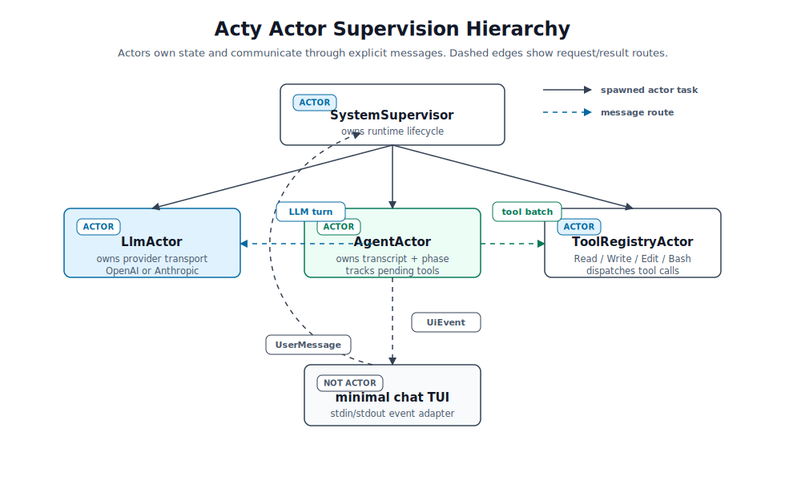

# acty

`acty` is a small teaching coding agent built around actor-style design. It is
meant to accompany the QCon AI Boston June 2026 talk. The code is kept small
enough to serve as a teaching resource for anyone who wants to apply
actor-style thinking to the runtime of agents.

The point of the repo is not to be a production agent. The point is to make the
runtime questions visible:

- What are the actors?
- What state does each actor own?
- What messages do they exchange?
- What can fail independently?
- Who supervises whom?

## Actor Shape



Acty is organized around a small supervision tree. Each actor owns one part of
the runtime, and other actors communicate with it by sending messages:

- `SystemSupervisor` owns lifecycle wiring. It starts the runtime actors, routes
  user messages into the agent, and sends shutdown to its children.
- `AgentActor` owns the agent loop. It keeps the transcript, tracks whether it is
  waiting on the LLM or tools, and resumes the loop when results arrive.
- `LlmActor` owns provider transport. It translates Acty's internal request into
  either an OpenAI-compatible Chat Completions request or an Anthropic Messages
  request.
- `ToolRegistryActor` owns tool dispatch. It checks the configured tool
  allow-list and runs `Read`, `Write`, `Edit`, or `Bash`.
- The minimal chat TUI is not an actor. It is a frontend adapter that sends
  `SystemMsg::UserMessage` and renders `UiEvent`s.

Only `AgentActor` is agentic. The other actors are runtime services that make
ownership, concurrency, and failure boundaries explicit.

The central flow is:

```text
user prompt
  -> SystemMsg::UserMessage
  -> AgentMsg::UserMessage
  -> AgentActor records transcript state
  -> LlmMsg::Generate
  -> AgentMsg::LlmFinished
  -> ToolRegistryMsg::DispatchBatch, when tools are requested
  -> AgentMsg::ToolFinished
  -> next LLM turn, until no tools are requested
```

The important boundary is the agent mailbox: user input, LLM responses, tool
results, and errors all return to the actor that owns the conversation state.
Actor mailboxes are bounded by `runtime.mailbox_capacity`, so a busy actor
applies backpressure instead of silently growing an unbounded queue.

## What Is Not Here

Acty is intentionally small. It does not include multi-layer reflection, a
production sandbox, actor restart policies, streaming responses, or a full
terminal UI framework. Those are all useful in larger agents, but this repo
keeps the focus on the runtime shape: actors, owned state, messages, and
supervision.

## Configure Providers

All runtime settings live in `acty.toml`, including the bounded actor mailbox
capacity. Acty supports two wire protocols:

- `protocol = "openai"` for OpenAI-compatible Chat Completions APIs.
- `protocol = "anthropic"` for Anthropic's Messages API.

Keep exactly one `[llm]` block uncommented. The checked-in config currently
uses Cerebras.

Each `[llm]` block also includes `provider_label`, a user-facing provider name
that Acty injects into the model-facing system prompt with the configured
protocol and model. This lets the assistant answer questions like "what model
are you using?" from runtime config instead of guessing.

### Local Llama

Use this for llama.cpp, Ollama-style, or other local servers that expose
`/v1/chat/completions`:

```toml
[llm]
provider_label = "local llama.cpp"
protocol = "openai"
base_url = "http://127.0.0.1:8080/v1"
model = "local-model"
max_tokens = 2048

[llm.auth]
mode = "none"

[llm.temperature]
mode = "fixed"
value = 0.2
```

### Cerebras

Cerebras is OpenAI-compatible. Set `CEREBRAS_API_KEY`, then use:

```toml
[llm]
provider_label = "Cerebras"
protocol = "openai"
base_url = "https://api.cerebras.ai/v1"
model = "gpt-oss-120b"
max_tokens = 2048

[llm.auth]
mode = "api_key_env"
name = "CEREBRAS_API_KEY"

[llm.temperature]
mode = "fixed"
value = 0.2
```

```sh
export CEREBRAS_API_KEY="..."
cargo run -- --config acty.toml
```

### OpenAI

Set `OPENAI_API_KEY`, then use OpenAI's Chat Completions endpoint:

```toml
[llm]
provider_label = "OpenAI"
protocol = "openai"
base_url = "https://api.openai.com/v1"
model = "gpt-5.1"
max_tokens = 2048

[llm.auth]
mode = "api_key_env"
name = "OPENAI_API_KEY"

[llm.temperature]
mode = "fixed"
value = 0.2
```

### Anthropic

Set `ANTHROPIC_API_KEY`, then use Anthropic's Messages API:

```toml
[llm]
provider_label = "Anthropic"
protocol = "anthropic"
base_url = "https://api.anthropic.com/v1"
model = "claude-sonnet-4-5"
max_tokens = 2048

[llm.auth]
mode = "api_key_env"
name = "ANTHROPIC_API_KEY"

[llm.temperature]
mode = "fixed"
value = 0.2
```

## Run

Interactive chat:

```sh
cargo run -- --config acty.toml
```

With the checked-in Cerebras config:

```sh
export CEREBRAS_API_KEY="..."
cargo run --quiet -- --config acty.toml
```

Example session:

````text
acty teaching chat. Type a prompt, or /quit.
> Who are you?
user: Who are you?
>
[turn 1]
> assistant: I'm Acty - a tiny coding assistant built to demonstrate actor-style
agent design. I work inside this workspace, can read, edit, and run code, and
help you with programming tasks. Let me know what you'd like to do!
[finish_reason=stop]
> [done]
> What model are you using?
user: What model are you using?
>
[turn 1]
> assistant: I'm running on Cerebras's gpt-oss-120b model (an OpenAI-compatible
Chat Completions endpoint).
[finish_reason=stop]
> [done]
> Write me a hello world program in rust
user: Write me a hello world program in rust
>
[turn 1]
> [assistant requested 1 tool call(s)]
[finish_reason=tool_calls]
> [tool start] Write {"content":"fn main() {\n    println!(\"Hello, world!\");\n}\n","path":"hello_world.rs"}
> [tool end] Write ok
wrote /Users/manjurajashekhar/Development/Mad-Labs/acty/./hello_world.rs
>
[turn 2]
> assistant: Created **hello_world.rs** with a simple Rust "Hello, world!" program:

```rust
fn main() {
    println!("Hello, world!");
}
```

[finish_reason=stop]
> [done]
````

One prompt:

```sh
cargo run -- --config acty.toml --prompt "inspect this repo and summarize the actor boundaries"
```
